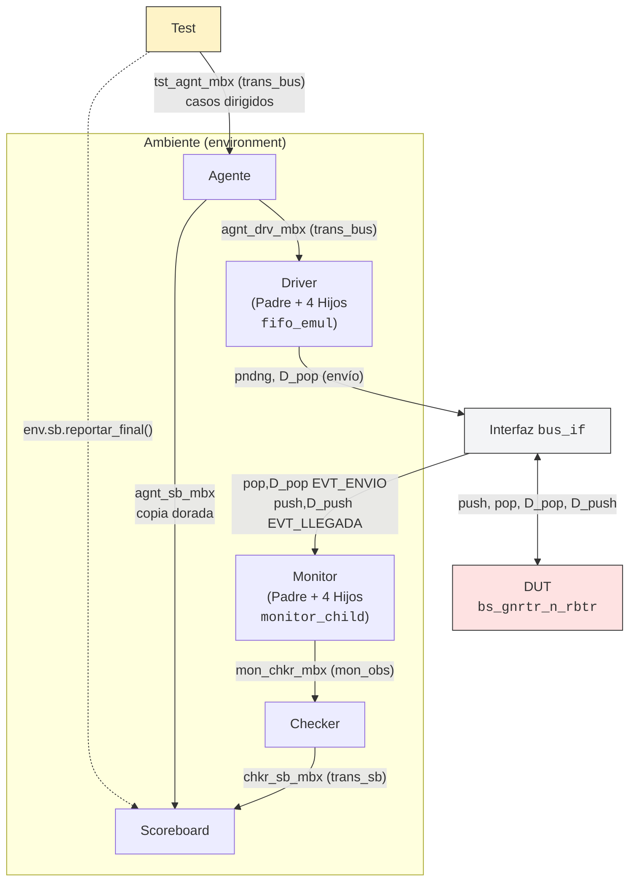

# Proyecto 1: Verificación Funcional de un Bus con Arbitraje Round-Robin

## Integrantes

| Nombre | Carné |
| :--- | :--- |
| Wilbert Alonso Román Rodríguez | 2019042296 |
| David Leiton | 2021103803 |

## Resumen del proyecto

Este proyecto consiste en el diseño e implementación de un ambiente de
verificación funcional basado en capas, siguiendo el modelo estándar de
aleatorización controlada visto en clase. El dispositivo bajo prueba (DUT)
es un bus de comunicación con `M` dispositivos (parametrizable como
2, 4 u 8) que opera mediante un controlador de arbitraje **round-robin
distribuido** (cada dispositivo mantiene su propio contador de turno,
sincronizado por una señal compartida) y transmite los datos de forma
**serial, bit a bit**, sobre una única línea física compartida. Las colas
de cada dispositivo (FIFOs) se **emulan del lado del testbench**
(`fifo_emul`, dentro del Driver); no son un recurso interno del DUT
verificado.

El ambiente desarrollado en SystemVerilog incluye Test, Agente, Driver,
Monitor, Checker y Scoreboard, corriendo en procesos independientes, para
emular el comportamiento de las interfaces del DUT e inyectar estímulos
de manera automatizada, tanto aleatorios como dirigidos.

## Objetivos

* Verificar funcionalmente el DUT `bs_gnrtr_n_rbtr` (módulo de arbitraje
  y serialización, definido en `src/Library.sv`).
* Demostrar la entrega correcta de los paquetes de datos, incluyendo
  mensajes dirigidos a un dispositivo específico y mensajes de
  *broadcast*.
* Validar la rotación adecuada del árbitro round-robin, incluida la
  vuelta del último dispositivo al primero.
* Corroborar el manejo de direcciones inválidas (hacia dispositivos que
  no existen en el sistema) y el identificador de *broadcast*.
* Evaluar el comportamiento del bus bajo múltiples configuraciones de
  cantidad de dispositivos (`drvrs`: 2, 4, 8) y ancho de payload
  (`bits`/`pckg_sz`: 16, 32, 64).

## Arquitectura del ambiente
 

 
> El Monitor observa ambos lados del protocolo del DUT: el envío
> (`pop`/`D_pop`) y la llegada (`push`/`D_push`). El informe completo
> (`docs/informe.pdf`) incluye la misma estructura en formato vectorial
> (TikZ).


## Jerarquía del repositorio

* **`src/`**: código fuente del DUT provisto por el curso (`Library.sv`
  y sus dependencias). No se modifica.
* **`tb/`**: código de verificación en SystemVerilog — transacciones
  (`trans_bus`, `trans_sb`, `mon_obs`), transactores (`agent`, `driver`,
  `monitor`, `checker`, `scoreboard`), el `environment`, el `test` y el
  módulo superior `testbench.sv`.
* **`docs/`**: documentación del proyecto — lineamientos del curso, el
  Test Plan y el informe final.
* **`scripts/`**: `histograma_retardos.plt`, el script de GNUplot que
  procesa los reportes CSV.
* **`results/`**: salida de las simulaciones — reportes CSV y las
  imágenes de los histogramas. Se versiona como evidencia de las
  corridas (no se ignora en `.gitignore`).


El análisis de resultados (histogramas de latencia) se hace localmente
con **GNUplot**, a partir del CSV que exporta el Scoreboard.

## Cómo compilar y correr

```bash
make compilar              # compila el ambiente (pckg_sz=16, drvrs=4 por defecto)
make simular SEED=7        # corre con una semilla puntual de randomize()
make regresion             # corre las semillas 1 a 5 y guarda un CSV por cada
                            # una en results/ (reporte_seed1.csv ... seed5.csv)
make agregar_regresion     # junta las 5 corridas de regresion en un solo CSV
                            # (results/reporte_agregado.csv), para el histograma
                            # del caso general
make barrido_pckgsz        # compila y corre por separado con pckg_sz = 16, 32, 64
make barrido_drvrs         # compila y corre por separado con drvrs = 2, 4, 8
make grafico                # genera histograma_retardos.png desde reporte_paquetes.csv
make grafico_de ARCHIVO=results/reporte_pckgsz64.csv SALIDA=results/hist_pckgsz64.png
                            # genera un histograma a partir de cualquier CSV de results/
make verificacion_completa  # corre regresion + ambos barridos + los 2 histogramas
                            # usados en el informe, de punta a punta
make limpiar                 # borra binarios y artefactos de compilacion de VCS/Verdi

make corrida_especifica SEED=7 DRVRS=8 PCKG_SZ=32
                            # corrida puntual con una combinacion especifica
                            # de semilla, numero de dispositivos y ancho de
                            # payload, todo en un solo comando; si se omite
                            # algun parametro, usa los valores por defecto
                            # (DRVRS=4, PCKG_SZ=16). Guarda el resultado en
                            # results/reporte_drvrs<N>_sz<M>_seed<S>.csv
```

`SEED` controla `+ntb_random_seed`, la opción de VCS que fija la
secuencia de `randomize()`. El `binwidth` del histograma se calcula
automáticamente a partir del rango real de datos de cada CSV; se puede
fijar a mano agregando `binwidth=<valor>` a la variable `-e` de GNUplot
si se corre el script directamente (ver el encabezado de
`scripts/histograma_retardos.plt`).

## Resultados principales

Sobre 5 semillas de regresión (1358 entregas, `pckg_sz=16`, `drvrs=4`) y
los barridos de `pckg_sz` (16/32/64) y `drvrs` (2/4/8), no se encontraron
inconsistencias de integridad de datos ni de temporización. Se
ejercitaron los tres resultados posibles del protocolo (`COMPLETADO`,
`PERDIDO`, `UNDERFLOW`), se verificó la cobertura funcional del árbitro
(cruce de dispositivo actual/anterior), y se documentó un hallazgo sobre
el comportamiento del árbitro ante un `reset` con una transacción en
curso. El detalle completo —metodología, Test Plan, componentes del
ambiente y resultados— está en `docs/informe.pdf` (generado a partir de
`docs/Proyecto1_Verificacion.tex`).

## Limitaciones conocidas

* El número de transacciones por corrida se configura como un total
  global, no de forma independiente por terminal.
* El emparejamiento de llegadas en el Scoreboard se apoya en que el
  byte de datos coincida entre el envío y la llegada; es una heurística
  razonable (con desempate por orden de transmisión) pero no una
  garantía absoluta ante una colisión exacta de datos entre paquetes en
  vuelo hacia el mismo destino.
* El comportamiento del árbitro ante un `reset` con solicitudes
  pendientes queda documentado como hallazgo abierto en el informe, sin
  una explicación completa a nivel de máquina de estados del RTL.